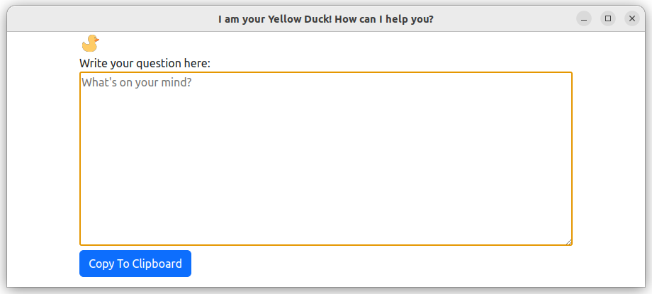

# my-yellow-duck

My Yellow Duck project. You can type anything you would like to ask someone on
slack/rocketchat etc.
When you are sure you want to copy your message... Duck will ask you are you sure?
When you are sure, press **Copy To Clipboard** 

...but... Yellow duck effect may happen before this. No one knows...



You can attach a shortcut in Ubuntu to your system toolbar.

# How to install
```shell
git clone https://github.com/JaroslawZielinski/my-yellow-duck.git
cd my-yellow-duck
npm install
npm start
```

## See
[Rubber duck debugging](https://en.wikipedia.org/wiki/Rubber_duck_debugging)
